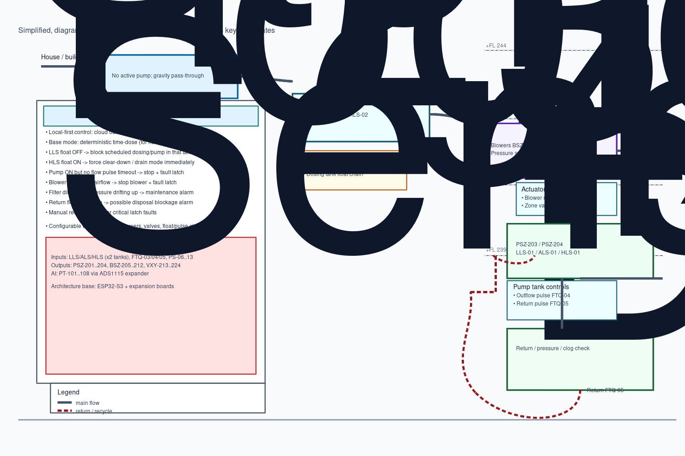

# Sterling Septic System Context

This document is the engineering reference for the Sterling septic controller stack as represented in this repo. It captures the control scope, data flow, and implementation assumptions without binding any one hardware revision as final.

## 1) Project scope and architecture (SOW-based)

The project is an **OSSF control stack** with three software surfaces:

- **Controller firmware (ESP32)**
  - Deterministic field logic for dosing, aeration, pumping, and fault response.
- **Backend services (AWS + MongoDB)**
  - Telemetry ingest, persistence, and history query APIs.
- **Web dashboard**
  - Monitor current device state and trends.

Core architectural constraint from SOW:

- **Local control first**.
  - The controller is authoritative and safety critical.
- **Cloud is observability only** for MVP.
  - Cloud should support visibility, audit, and operations, not replace deterministic field logic.
- **Safe operation under adverse network conditions**.
  - Controller behavior must remain consistent on reboot, power loss, and network loss.

In-scope MVP behavior:

- Deterministic state transitions and safety interlocks.
- Telemetry and alarm stream into a backend for operator visibility.
- Manual handover-ready documentation and topology that can be expanded to larger profiles later.

## 2) System components and responsibilities

### 2.1 MCU / firmware (field controller)

- Runs local state logic for pumps, blowers, valves, and alarms.
- Samples DIs, DOs, and AIs.
- Enforces fault interlocks and latches critical safety errors.
- Handles startup/reboot reset state.
- Produces periodic telemetry and event messages.

### 2.2 Backend (cloud API + data layer)

- Receives and stores telemetry from controller.
- Serves latest state and historical series for dashboard queries.
- Provides operator authentication.
- Does not own safety commands in MVP.

### 2.3 Web dashboard

- Displays live and trend data for each controller.
- Shows alarm list and history for operator actions.
- Helps ops staff see faults and infer maintenance actions.
- No direct safety-critical closed-loop decisions.

### 2.4 Deployment environment

- Backend expected in AWS with MongoDB for telemetry persistence.
- Dashboard served as web app over HTTPS.
- Controller communicates via Ethernet with backend (as per current scope), with future options for longer-distance transport assessed only after core reliability.

## 3) Deterministic local control model and safety behavior

### 3.1 Local safety-first control

- Control loop priority: **Protective safety > alarm state > scheduled demand > normal cycle transitions**.
- Safety rules are local-only and should not depend on cloud acknowledgements.
- Faults that are critical to overflow, dry-run, or dead-head conditions are immediate and local.

### 3.2 Safe defaults on fail states

- **Reboot / power cycle**:
  - All outputs forced to safe state: pumps/air movers/valves off until explicit safe startup checks pass.
- **Network loss / backend loss**:
  - Continue deterministic local run using last known good config and timeout-aware protections.
  - Telemetry retries as a non-blocking best-effort path.
- **Sensor dropout**:
  - Do not assume healthy sensor on missing input.
  - Block transitions that require the missing input.

### 3.3 Required interlocks and fault handling

- **Float interlock**:
  - Pump-on float OFF blocks pump start for that tank.
- **High-level interlock**:
  - Any high-level float ON drives forced clear-down behavior for the affected stage/flow path.
- **Flow validation interlock**:
  - If a component is commanded ON but no expected flow pulse appears within timeout, stop device and alarm.
- **Blower validation interlock**:
  - If blower is commanded ON but blower airflow/status signal is not present, stop blower and alarm.
- **Disposal/field discharge interlock**:
  - Pressure differential / return mismatch triggers maintenance path instead of continuing into unknown fault state.

### 3.4 Critical vs non-critical alarms

- **On-device critical alarms (offline-first):**
  - High water alarms.
  - Pump flow-loss faults.
  - Blower airflow faults.
  - Hard safety interlock violations (e.g., dry-run risks).
- **Server-side non-critical / predictive alarms:**
  - Trend-based maintenance indicators.
  - Filter/service life / efficiency patterns.
  - Analytics hints that can be surfaced without forcing immediate shutdown.

## 4) 4-stage process architecture

The documented wastewater chain is:

1. **Trash tank**
   - Raw inlets feed gravity-first stage.
2. **Dosing / equalization**
   - Receives overflow from stage 1.
   - Dosed and/or time/interval controlled fill to ATU feed.
3. **ATU (aerobic treatment)**
   - Aerators/blowers provide oxygenation.
4. **Pump + chlorination**
   - Treated water is pumped/conditioned to disposal.

### 4.1 Optional stage at end

- **Disposal / holding / distribution vessel** is still an open architectural question.
- Current docs treat it as optional terminal node to confirm by layout and wiring response.

## 5) Control logic rules (from meeting notes)

Use these as baseline behaviors unless superseded by signed-off pinout + safety test notes:

- `pump-on float OFF => run-block`
- `high level ON => forced clear-down`
- `flow-on-command timeout => stop + alarm`
- `blower command/no airflow => stop + alarm`
- `disposal mismatch/pressure delta => maintenance`

### Fault state expectations

- Critical faults should latch until explicit operator acknowledgement/reset.
- Alarms should be explicit and machine-readable for backend eventing and dashboard rendering.

## 6) Configurability and scale targets

### 6.1 Baseline target (residential MVP)

- Core logic tuned for compact setup and reliability.
- Start with minimum working count profile: `2 pumps + 2 ATUs` (from workshop notes), while preserving abstraction for expansion.

### 6.2 Expansion target (commercial)

- Scale the same logic model by config, not by rewriting state behavior.
- SOW allows up to:
  - Pumps: 4
  - Blowers: 8
  - Valves: 12
  - AIs: 8 used + spares
- Workshop explicitly called out `4 pumps / 6 ATUs` for future expansion.

### 6.3 Configurable parameters

- Timing constants and debounce windows.
- Dosing profile mode + intervals.
- Tank-specific stage counts and assignment of channel to physical components.
- Pressure/flow thresholds and alert deadbands.
- Alarm classification, ack, and reset policy.

## 7) Full IO map (from attached CSV)

### 7.1 DI

| ID | Description | IO slot | IO channel | Board model | I2C address |
| --- | --- | --- | --- | --- | --- |
| LLS-01 | Low level switch dosing | 0 | 1 | ESP32 digital input bus | - |
| ALS-01 | Alarm Level switch dosing | 0 | 2 | ESP32 digital input bus | - |
| HLS-01 | High (Lag) level swithc dosing | 0 | 3 | ESP32 digital input bus | - |
| LLS-02 | low level switch pump | 0 | 4 | ESP32 digital input bus | - |
| ALS-02 | Alarm Level switch pump | 0 | 5 | ESP32 digital input bus | - |
| HLS-02 | High (Lag) level switch pump | 0 | 6 | ESP32 digital input bus | - |
| spare | spare | 0 | 7 | ESP32 digital input bus | - |
| spare | spare | 0 | 8 | ESP32 digital input bus | - |
| FTQ-03 | dosing flow pulse | 1 | 0 | MCP23017 IO Expansion Board | 0x20 |
| FTQ-04 | effluent out flow pulse | 1 | 1 | MCP23017 IO Expansion Board | 0x20 |
| FTQ-05 | effluent return flow pulse | 1 | 2 | MCP23017 IO Expansion Board | 0x20 |
| PS-06 | blower 1 pressure switch | 1 | 3 | MCP23017 IO Expansion Board | 0x20 |
| PS-07 | blower 2 pressure switch | 1 | 4 | MCP23017 IO Expansion Board | 0x20 |
| PS-08 | blower 3 pressure switch | 1 | 5 | MCP23017 IO Expansion Board | 0x20 |
| PS-09 | blower 4 pressure switch | 1 | 6 | MCP23017 IO Expansion Board | 0x20 |
| PS-10 | blower 5 pressure switch | 1 | 7 | MCP23017 IO Expansion Board | 0x20 |
| PS-11 | blower 6 pressure switch | 1 | 8 | MCP23017 IO Expansion Board | 0x20 |
| PS-12 | blower 7 pressure switch | 1 | 9 | MCP23017 IO Expansion Board | 0x20 |
| PS-13 | blower 8 pressure switch | 1 | 10 | MCP23017 IO Expansion Board | 0x20 |
| spare | spare | 1 | 11 | MCP23017 IO Expansion Board | 0x20 |
| spare | spare | 1 | 12 | MCP23017 IO Expansion Board | 0x20 |
| spare | spare | 1 | 13 | MCP23017 IO Expansion Board | 0x20 |
| spare | spare | 1 | 14 | MCP23017 IO Expansion Board | 0x20 |
| spare | spare | 1 | 15 | MCP23017 IO Expansion Board | 0x20 |

### 7.2 DO

| ID | Description | IO slot | IO channel | Board model | I2C address |
| --- | --- | --- | --- | --- | --- |
| PSZ-201 | Dosing Pump 1 | 2 | 1 | ESP32 relay output bus | - |
| PSZ-202 | Dosing Pump 2 | 2 | 2 | ESP32 relay output bus | - |
| PSZ-203 | Effluent Pump 1 | 2 | 3 | ESP32 relay output bus | - |
| PSZ-204 | Effluent Pump 2 | 2 | 4 | ESP32 relay output bus | - |
| spare | spare | 2 | 5 | ESP32 relay output bus | - |
| spare | spare | 2 | 6 | ESP32 relay output bus | - |
| spare | spare | 2 | 7 | ESP32 relay output bus | - |
| spare | spare | 2 | 8 | ESP32 relay output bus | - |
| BSZ-205 | Blower Pressure Switch 1 | 3 | 0 | MCP23017 IO Expansion Board | 0x21 |
| BSZ-206 | Blower Pressure Switch 2 | 3 | 1 | MCP23017 IO Expansion Board | 0x21 |
| BSZ-207 | Blower Pressure Switch 3 | 3 | 2 | MCP23017 IO Expansion Board | 0x21 |
| BSZ-208 | Blower Pressure Switch 4 | 3 | 3 | MCP23017 IO Expansion Board | 0x21 |
| BSZ-209 | Blower Pressure Switch 5 | 3 | 4 | MCP23017 IO Expansion Board | 0x21 |
| BSZ-210 | Blower Pressure Switch 6 | 3 | 5 | MCP23017 IO Expansion Board | 0x21 |
| BSZ-211 | Blower Pressure Switch 7 | 3 | 6 | MCP23017 IO Expansion Board | 0x21 |
| BSZ-212 | Blower Pressure Switch 8 | 3 | 7 | MCP23017 IO Expansion Board | 0x21 |
| spare | spare | 3 | 8 | MCP23017 IO Expansion Board | 0x21 |
| spare | spare | 3 | 9 | MCP23017 IO Expansion Board | 0x21 |
| spare | spare | 3 | 10 | MCP23017 IO Expansion Board | 0x21 |
| spare | spare | 3 | 11 | MCP23017 IO Expansion Board | 0x21 |
| spare | spare | 3 | 12 | MCP23017 IO Expansion Board | 0x21 |
| spare | spare | 3 | 13 | MCP23017 IO Expansion Board | 0x21 |
| spare | spare | 3 | 14 | MCP23017 IO Expansion Board | 0x21 |
| spare | spare | 3 | 15 | MCP23017 IO Expansion Board | 0x21 |
| VXY-213 | Zone Control Valve 1 | 4 | 0 | MCP23017 IO Expansion Board | 0x22 |
| VXY-214 | Zone Control Valve 2 | 4 | 1 | MCP23017 IO Expansion Board | 0x22 |
| VXY-215 | Zone Control Valve 3 | 4 | 2 | MCP23017 IO Expansion Board | 0x22 |
| VXY-216 | Zone Control Valve 4 | 4 | 3 | MCP23017 IO Expansion Board | 0x22 |
| VXY-217 | Zone Control Valve 5 | 4 | 4 | MCP23017 IO Expansion Board | 0x22 |
| VXY-218 | Zone Control Valve 6 | 4 | 5 | MCP23017 IO Expansion Board | 0x22 |
| VXY-219 | Zone Control Valve 7 | 4 | 6 | MCP23017 IO Expansion Board | 0x22 |
| VXY-220 | Zone Control Valve 8 | 4 | 7 | MCP23017 IO Expansion Board | 0x22 |
| VXY-221 | Zone Control Valve 9 | 4 | 8 | MCP23017 IO Expansion Board | 0x22 |
| VXY-222 | Zone Control Valve 10 | 4 | 9 | MCP23017 IO Expansion Board | 0x22 |
| VXY-223 | Zone Control Valve 11 | 4 | 10 | MCP23017 IO Expansion Board | 0x22 |
| VXY-224 | Zone Control Valve 12 | 4 | 11 | MCP23017 IO Expansion Board | 0x22 |
| spare | spare | 4 | 12 | MCP23017 IO Expansion Board | 0x22 |
| spare | spare | 4 | 13 | MCP23017 IO Expansion Board | 0x22 |
| spare | spare | 4 | 14 | MCP23017 IO Expansion Board | 0x22 |
| spare | spare | 4 | 15 | MCP23017 IO Expansion Board | 0x22 |

### 7.3 AI

| ID | Description | IO slot | IO channel | Board model | I2C address |
| --- | --- | --- | --- | --- | --- |
| PT-101 | Effluent upstream pressure | 5 | 0 | ADS1115 ADC Expansion Board | 0x48 |
| PT-102 | Effluent downstream pressure | 5 | 1 | ADS1115 ADC Expansion Board | 0x48 |
| PT-103 | Effluent return pressure | 5 | 2 | ADS1115 ADC Expansion Board | 0x48 |
| PT-104 | users assign pressure 1 | 5 | 3 | ADS1115 ADC Expansion Board | 0x48 |
| PT-105 | users assign pressure 2 | 6 | 0 | ADS1115 ADC Expansion Board | 0x49 |
| PT-106 | users assign pressure 3 | 6 | 1 | ADS1115 ADC Expansion Board | 0x49 |
| PT-107 | users assign pressure 4 | 6 | 2 | ADS1115 ADC Expansion Board | 0x49 |
| PT-108 | users assign pressure 5 | 6 | 3 | ADS1115 ADC Expansion Board | 0x49 |
| spare | spare | 7 | 0 | ADS1115 ADC Expansion Board | 0x4A |
| spare | spare | 7 | 1 | ADS1115 ADC Expansion Board | 0x4A |
| spare | spare | 7 | 2 | ADS1115 ADC Expansion Board | 0x4A |
| spare | spare | 7 | 3 | ADS1115 ADC Expansion Board | 0x4A |

## 8) IO map ambiguities to resolve before coding

- **SOW says no direct ESP32 GPIO for field I/O**, but DI/DO entries for slot 0 and slot 2 are marked as `ESP32 digital input bus` and `ESP32 relay output bus`.
- **BSZ naming conflict:** `BSZ-205..212` are described as "Blower Pressure Switch" but appear in DO block.
  - This strongly suggests they are actually blower actuator outputs and the label should be corrected.
- Missing explicit signal details:
  - DI polarity (NO/NC), active level, and debounce defaults.
  - Pump/blower relay command convention (energize to run vs. de-energize fail-safe).
  - Analog scaling details (range, units, filtering).
  - Flow pulse K-factor constants per channel.

## 9) Assumptions, known gaps, and open questions

### Assumptions

- Current logic baseline comes from meeting and workshop docs and is valid for a residential-first rollout.
- Existing UI labels and RL references are close-enough for process semantics, not an approved electrical map.
- `0x20/0x21/0x22` MCP23017s and `0x48/0x49/0x4A` ADS1115s are the intended expansion pattern.

### Known gaps

- Final hardware pinout confirmation and relay polarity still pending.
- No signed-off float/air-switch truth table exists in current docs.
- Flow pulse scaling and pressure transducer unit details not yet defined.

### Open questions

- Is there a dedicated holding/distribution tank before disposal?
- Confirm ESP32 slot 0/2 semantics relative to SOW non-negotiable constraints.
- Confirm BO logic for high-level and maintenance priority in simultaneous fault scenarios.
- Provide full controller/firmware revision and revision-specific calibration constants.

## 10) Visual references

The following plan images are now included in this repo:

### Additional images imported from memory capture set

- `/docs/images/1dc90871-1943-4859-b90c-0a0adeb190b9.webp`
- `/docs/images/3261d2e3-bf90-490b-8980-cf7ac41c3902.webp`
- `/docs/images/3a3ae3d8-fcb0-463a-bede-0bac1ed7dfdd.webp`
- `/docs/images/4986622f-3bc8-46c7-a599-6de739e7982b.webp`
- `/docs/images/55e4b5dc-d9c6-4f52-9d1d-b9bc2244b1f5.webp`
- `/docs/images/86195c2e-9e70-4790-9f00-f135de86fce8.webp`
- `/docs/images/8f7c50de-2330-4a35-bb72-5ca0ff31a5e3.webp`
- `/docs/images/a092a1ff-cbe4-4efe-aaf3-695ecfcb3614.webp`
- `/docs/images/f8376ef1-7d2d-4fe1-9ca9-e2645943646c.webp`

## 11) Source docs and evidence

Reference set used for this context file:

- `memory/sterling-septic-job/docs/system-logic.md`
- `memory/sterling-septic-job/docs/open-questions.md`
- `memory/sterling-septic-job/docs/fathom-recap-2026-03-26.md`
- `memory/sterling-septic-job/docs/pinout-diagram-v1-review.md`
- `memory/sterling-septic-job/docs/sow-summary-2026-01-30.md`
- `memory/sterling-septic-job/raw/pinout-sterling-v1.csv`

## 12) Checklist

### Added in this document set

- [x] Added full process architecture and state model summary.
- [x] Added deterministic safety behavior and fault model.
- [x] Added all control rules from current meeting docs.
- [x] Added full DI/DO/AI map from attached CSV with slot/channel/board/address.
- [x] Added ambiguities, assumptions, gaps, and open questions explicitly.
- [x] Added visual references and copied plan screenshots into repo docs path.

### Still unknown / needs follow-up

- [ ] Confirm corrected pin naming/typing for BSZ channels and pressure switch locations.
- [ ] Confirm slot 0/2 direct-ESP32 semantics against non-negotiable SOW constraints.
- [ ] Confirm terminal holding/distribution stage and exact disposal confirmation behavior.
- [ ] Confirm signal polarity, calibration constants, and alarm thresholds.

## 13) MacBook plan folder check

Mac Desktop plan folder at `/Users/steve/Desktop/sterling-osst-plan` was checked via `openclaw nodes run`.

- Available files: 9 PNG screenshots stamped `Screenshot 2026-03-26 at 21.52.xx.png`.
- **Local copy of these files is not included in this session** due mac-to-VPS transfer limits, so this repo keeps the memory-based screenshots as the canonical in-repo visual baseline.
- If those Mac screenshots are preferred, copy them into `docs/images/` and mirror the same filenames in this section.
